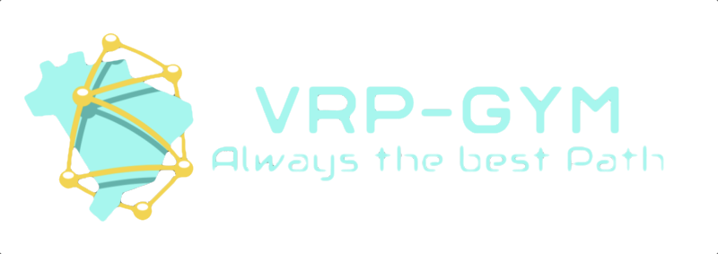

<!-- PROJECT LOGO -->
<br />
<div align="center">
  <a href="https://github.com/github_username/repo_name">
    
  </a>
</div>

#

<!-- ABOUT THE PROJECT -->
## About The Project
An easy to use, understand and extend Vehicle Routing Problem Environment build with underlying OpenAI Gym architecture. VRP-Gym provides several variants of the Problem including:
   * Travelling Salesman Problem (TSP)
   * Default VRP (Start on Depot and have to return to it)
   * Inventory Routing Problem (Vehicle is responsible for satisfying the demands in each delivery point)

The code can be easily extended to support other variants of the VRP Problem. We also provide a state of the art attention based graph agent based on [ATTENTION, LEARN TO SOLVE ROUTING PROBLEMS!](https://arxiv.org/pdf/1803.08475.pdf) and a random decision based agent. We evaluated the attention agent against the random agent on all three variant environments. The visualized results of the training and evaluation statistics can be found in `notebooks/results.ipynb` or in the `images` folder.

#### VRP-Agent:

#### IRP-Agent:


<!-- GETTING STARTED -->
## Getting Started

### Prerequisites
To install the required packages we recommend using [Conda](https://docs.conda.io/en/latest/). Our used environment can be easily installed with conda.

### Installation

1. Clone the repo
   ```sh
   git clone https://github.com/kevin-schumann/VRP-GYM
   ```
2. Install conda environment
   ```sh
   conda env create -f environment.yml
   ```
3. Activate the environment
   ```sh
   conda activate gym_vrp
   ```

### Tests
1. Go to the project directory and run
   ```sh
    pytest tests/
   ```

<!-- USAGE EXAMPLES -->
## Usage
To initialize an vrp environment and train an agent you just need a few lines of code. Suppose you want to train the attention agent on the IRP problem:
```py
from gym_vrp.envs import VRPEnv
from agents import VRPAgent

# Init the environment
env = VRPEnv(num_nodes=20, batch_size=512)

# Init the agent
agent = VRPAgent()
# Start training
agent.train(env)
```

The agent will save his progress every 50 epochs in a directory called `check_points`.

_For more advanced usage and architecture insights you can look at the [docs](/docs/)_.
## Reproduction
To reproduce our results just run the `reproduction.sh`script inside the environment. 
We used several seeds for training and evaluation.
For training seeds and process see `train_models.py` and for evaluation seeds see `reproduction.py`.

```sh
./reproduction.sh
```
NOTE: The models were trained and stored using CUDA, therefore they can only be loaded under CUDA.
We used a Nvidia GTX 1070 TI and 16GB RAM to evaluate the agent on our envs.

The above script will call the `reproduction.py` file with different environments.
For the py file different arguments can be provided when used to evaluate a model, which are default set to the ones we used to evaluate our implementation.
* --seeds: The used seeds for the env generation. __*Default: [1234, 2468, 2048]*__
* --batch_size: The used batch size. __*Default: 256*__
* --num_nodes: Number of nodes in the evaluation graphs. __*Default: 20*__
* --num_draw: Number of graphs that should be included in the video. __*Default: 3*__
* --csv_path: Path where the results should be saved: __*Default: 'reproduction_results.csv'*__
* --model_path: Path to the train file of the model to evaluate against Random Agent.
* --env_type: The environment variant that should be used. __Values: ['TSP', 'VRP', 'IRP'].__ __*Default: 'TSP'*__

This script also produces a video of the evaluated agent, which will be saved in the `./videos` folder.

<!-- CONTACT -->
## Contact

1. [Paul Heinemeyer](https://github.com/SwiftPredator) - paul_heinemeyer@outlook.de
2. [Kevin Schumann](https://github.com/kevin-schumann) - ks.kevinschumann@gmail.com


